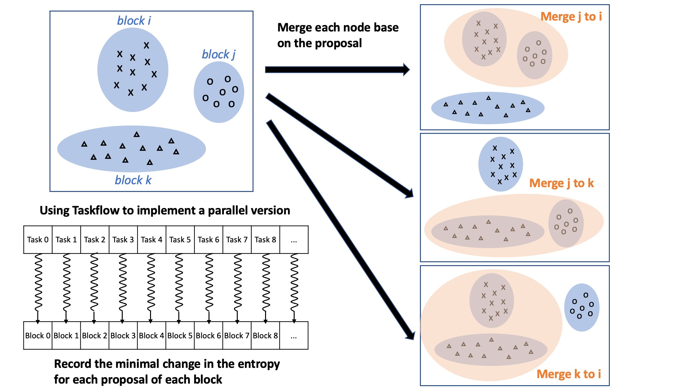
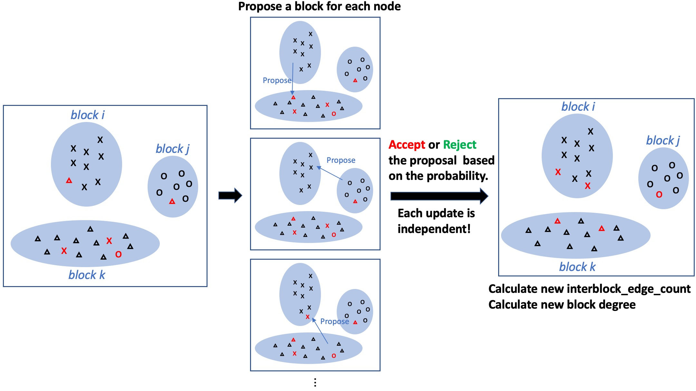
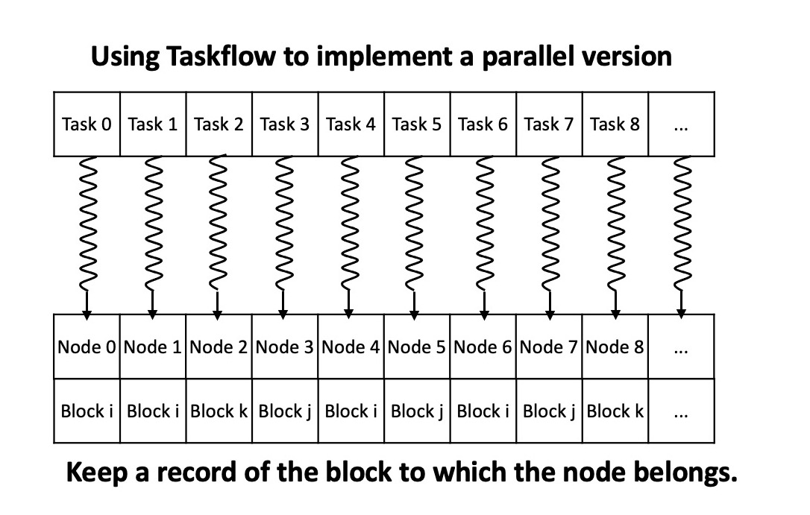
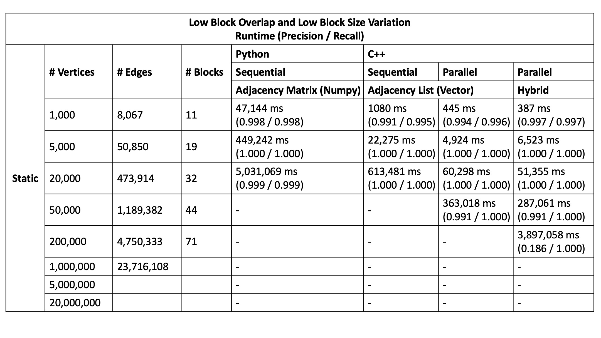

# graph_partition
Streaming graph partition written in c++

## Compile
```
mkdir build && cd build
cmake ..
make
```

## Run
```
./run [N (1000 / 5000 / 20000 / 50000)]
```

## Algorithm
### Parallel Block Merge

### Iterative Nodal Update

### Parallel Nodal Update



## Result

### Static Graph Statistics
The dataset is from [2022 Streaming Partition Challenge Datasets with Known Truth Partitions](http://graphchallenge.mit.edu/data-sets)


## TODO
- [ ] Streaming Graph Input
