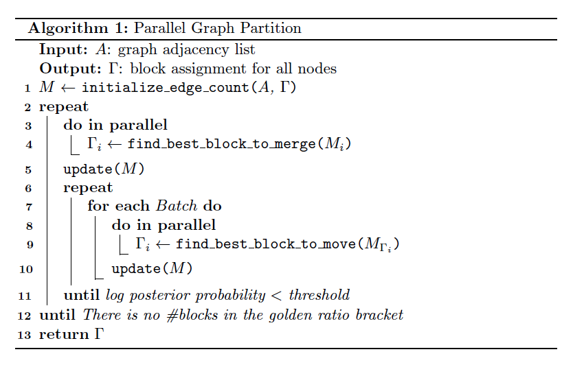
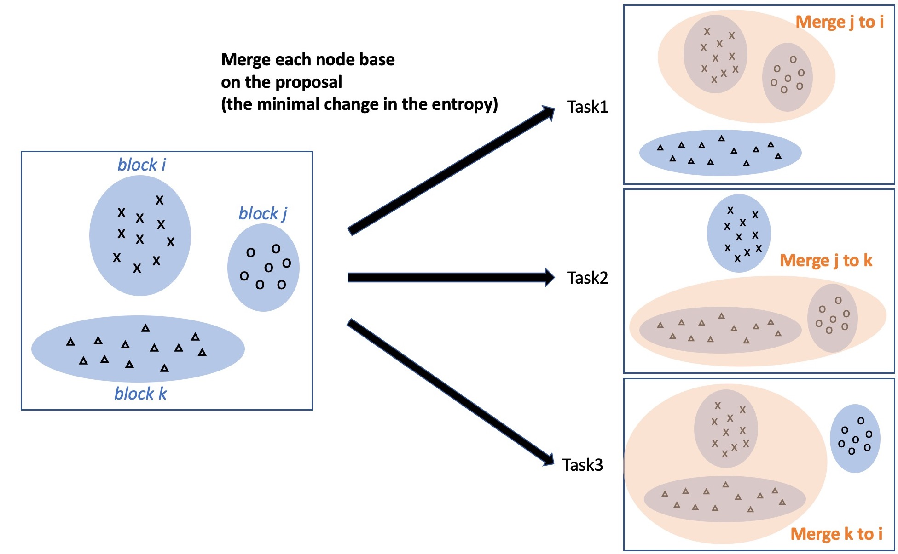
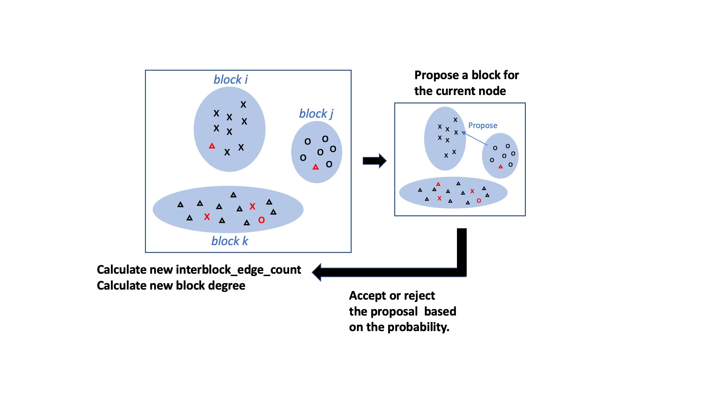
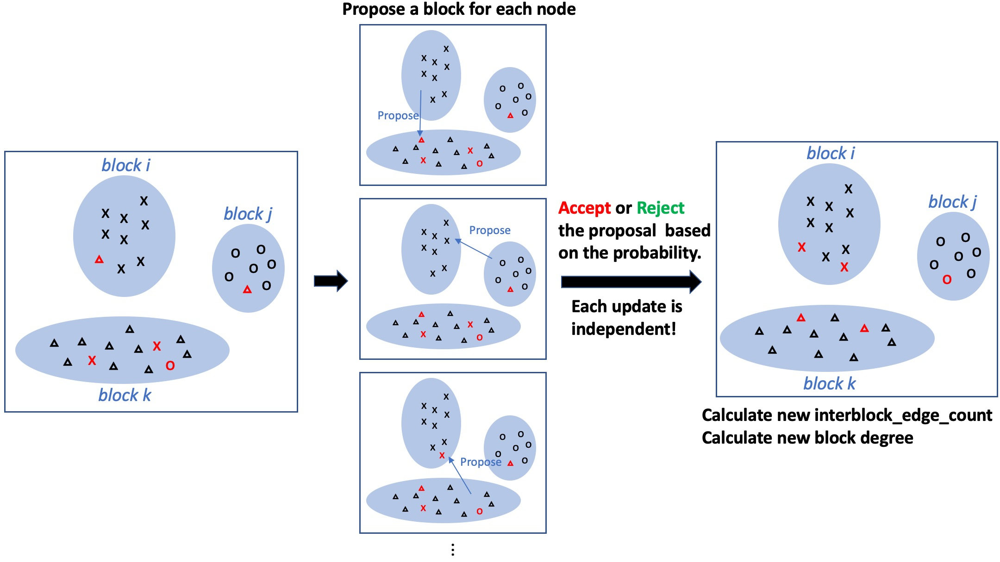
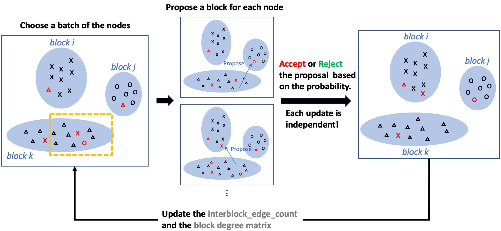
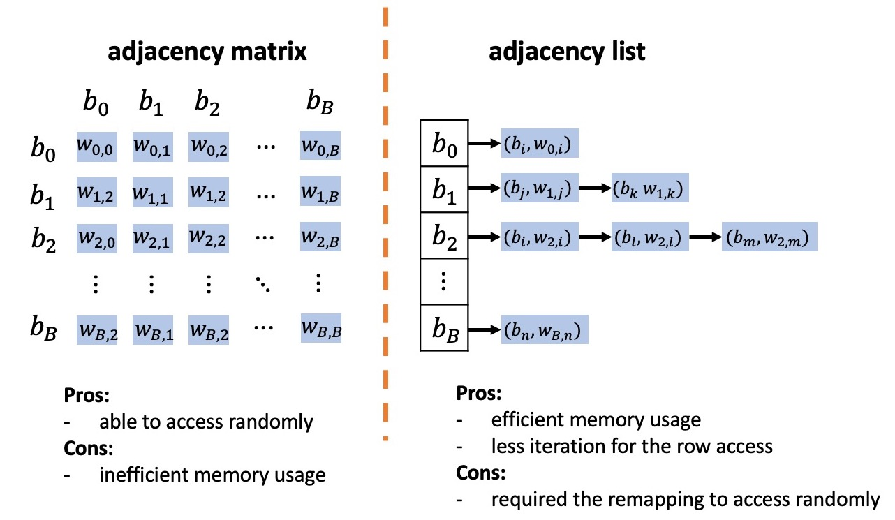
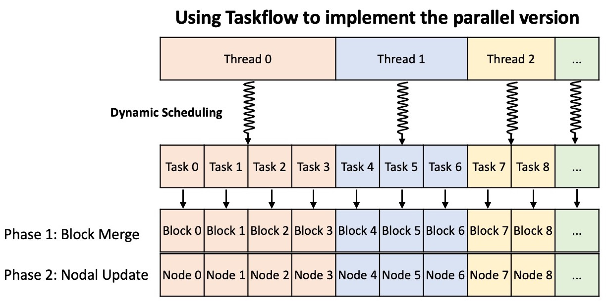

# graph_partition
Streaming graph partition written in c++

## Compile
```
mkdir build && cd build
cmake ..
make
```

## Run
```
./run [N (1000 / 5000 / 20000 / 50000)]
```

## Algorithm


---

### Parallel Block Merge
To find the optimal proposal block with the smallest change in delta entropy for merging, each block is given K attempts.



---

### Iterative Nodal Update
- Baseline version



### Parallel Nodal Update
- Accept or reject the nodal movement based on the same state, and then update the partition after this run



### Parallel Batch Nodal Update

- Choose a batch of nodal to move



---

### Hybrid Data Structure

- Leverage the benefits of both adjacency matrix and adjacency list. The experiment result show that the best size for the matrix is 1024x1024.



---

### Taskflow



---

## Result

### Static Graph Statistics
The dataset is from [2022 Streaming Partition Challenge Datasets with Known Truth Partitions](http://graphchallenge.mit.edu/data-sets)


- Using different block size to determine to use matrix or list


## TODO
- [ ] Streaming Graph Input
