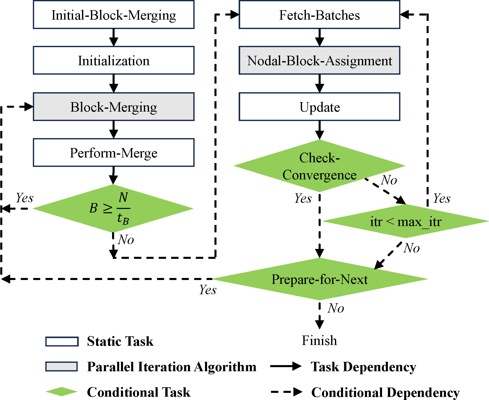
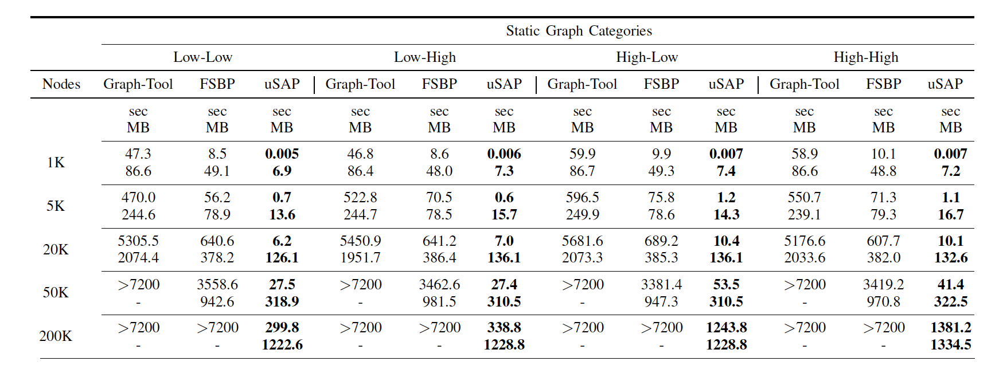

# uSAP: An Ultra-Fast Stochastic Graph Partitioner
Streaming graph partition written in c++

## Compile
```
mkdir build && cd build
cmake ..
make
```

## Run
```
./run  [ (1 / 2 / 3 / 4) ] [N (1000 / 5000 / 20000 / 50000)]
```

## Algorithm

---

### Parallel Block Merge
To find the optimal proposal block with the smallest change in delta entropy for merging, each block is given K attempts.


---

### Parallel Batch Nodal Update

- Choose a batch of nodal to move


---

### Taskflow



---

## Result

The dataset is from [2022 Streaming Partition Challenge Datasets with Known Truth Partitions](http://graphchallenge.mit.edu/data-sets)



## TODO
- [ ] Streaming Graph Input
- [ ] GPU


- Entropy after merging


